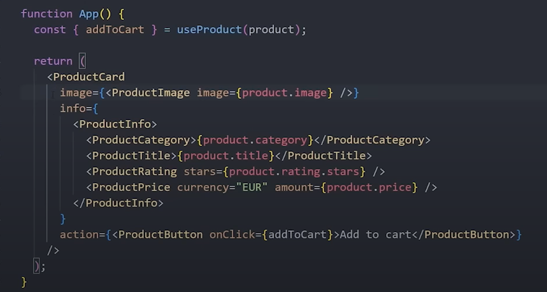

# Problem

Ever have a component build perfectly on your needs for an amount of time then suddently PO or Designer said **"We need to add this/that to this UI/Component"**

Lol, you have to go to that component, adding more props and style to make it serve the new case requested. Right ?

Another issue with the prebuild component would be
> It will never suit every cases

So other devs who use the component may/have to add more props to component to make it serve the new case

# Component Composition

The first thing you can adjust to make the component more **flexible** is to modulize all of the component parts

For example if you have a `<Card/>` component which render an item with image and some infos, you can seperate them into `<CardImage/>` and `<CartInfo/>`

=> this way your component will be more **customizable** and **composable**

Tips: 
- Using Composition Component with **Context** will help reduce the props passing in each modular component
- Combining with JS Function Object, we can define a default component for the modular component.

    Example: `Cart.CartImage = CartImage` this way we only need to import the Cart Component

# Drawbacks

Even though this is a really nice idea of building a component, it is not **developer friendly**.

Imagine building a UI Component Library, you have to deliver only the component that serve the best case right, users (devs) won't be happy if they need to import a-lot just to use a component (and the doc gonna be long as well)

> Choose the custom part wisely
