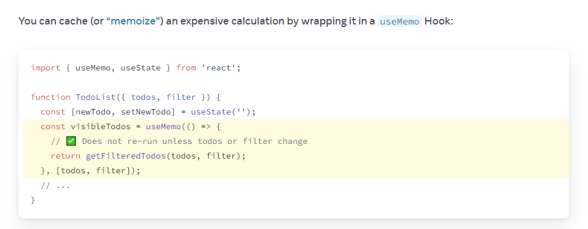

# Immune Props

1. Object Freeze
2. Proxy the Object and throw error if set is called
3. Immuntable.js
4. Object.define property
5. Object.seal
6. private field

# what happen when setState() is called

The first thing React will do when setState is called is **merged the object** you passed into setState into the current state of the component. This will kick off a process called **reconciliation**. The end goal of reconciliation is to, in the most efficient way possible, update the UI based on this new state.

To do this, React will construct a new tree of React elements (which you can think of as an object representation of your UI). Once it has this tree, in order to figure out how the UI should change in response to the new state, React will diff this new tree against the previous element tree.

By doing this, React will then know the exact changes which occurred, and by knowing exactly what changes occurred, will able to **minimize its footprint** on the UI by only making updates where absolutely necessary.

The setState() will run functions in this order:

1. shouldComponentUpdate()
2. componentWillUpdate()
3. render()
4. componentDidUpdate()

# Key

When children have keys, React uses the key to match children in the original tree with children in the subsequent tree.

The key only has to be unique among its siblings, not globally unique.

# React-Virtualize

So many elements in the DOM can cause two problems:

- Slow initial rendering
- Laggy scrolling

> How does react-virtualized work?

**rendering only what is visible**, this one is the same as List Adapter in Android

1. They calculate which items are visible inside the area where the list is displayed (the viewport).
2. They use a container (div) with relative positioning to absolute position the children elements inside of it by controlling its top, left, width and height style properties.

### Important HOC for this article

- **ArrowKeyStepper**. It decorates another component so it can respond to arrow-key events.
- **AutoSizer**. It automatically adjusts the width and height of another component.
- **CellMeasurer**. It automatically measures a cell’s contents by temporarily rendering it in a way that is not visible to the user.
- **ColumnSizer**. It calculates column-widths for Grid cells.
- **InfiniteLoader**. It manages the fetching of data as a user scrolls a List, Table, or Grid.
- **MultiGrid**. It decorates a Grid component to add fixed columns and/or rows.
- **ScrollSync**.It synchronizes scrolling between two or more components.
- **WindowScroller**. It enables a Table or List component to be scrolled based on the window’s scroll positions.

**Components like AutoSizer use a pattern named function as child components.**

    <AutoSizer>
    ({ width, height }) => {
    }
    </AutoSizer>

**cannot share a CellMeausure cache between two components**

# React vs React Native?

> What's the different ?

React -> JS Engine -> Browser (Document) -> OS
React Native -> JS Engine -> Brige -> OS

In React Native, js code will be serialize (parse) into the OS language its required to run on native apps

React is a library, it's allow you to do more than follow a fixed structure while React Native is a framework which force you to follow the structure

# Stale Closure when using React Hooks

    function WatchCount() {
        const [count, setCount] = useState(0);
        useEffect(function() {
            setInterval(function log() {
            console.log(`Count is: ${count}`);
            }, 2000);
        }, []);
        return (
            

            {count}
            <button onClick={() => setCount(count + 1) }>
                Increase
            </button>
            

        );
    }

> Here's how to fix it

    useEffect(function() {
        const id = setInterval(function log() {
        console.log(`Count is: ${count}`);
        }, 2000);
        return function() {
            clearInterval(id);
        }
    }, [count]);

We fix the interval by creating a new one after 2 second -> that's when closure capture new value

# Render Props

Refer to a technique for sharing code between React components using a prop whose value is a function

> Remove duplicate code between components

The Pattern is to create a **wrapper function** at the top level -> passing down the props as function use to render the state and wire it with function that use to modify the state.

more depth: https://www.youtube.com/watch?v=3IdCQ7QAs38

# Virtual DOM vs Real DOM

compare works in RAM for Virtual DOM so it's faster than RealDOM

# HashRouter vs BrowserRouter

**BrowserRouter** uses history API, i.e. it's unavailable for legacy browsers (IE 9 and lower and contemporaries). Client-side React application is **able to maintain clean routes** like example.com/react/route but needs to be **backed by web server**.

**HashRouter** uses URL hash, it puts no limitations on supported browsers or web server. **Server-side routing is independent from client-side routing**.

Backward-compatible single-page application can use it as example.com/#/react/route.

# Fetching on "mount" pitfalls

- **Effects don’t run on the server**. This means that the initial server-rendered HTML will only include a loading state with no data. The client computer will have to download all JavaScript and render your app only to discover that now it needs to load the data. This is not very efficient.
- **Fetching directly in Effects makes it easy to create “network waterfalls”**. You render the parent component, it fetches some data, renders the child components, and then they start fetching their data. If the network is not very fast, this is significantly slower than fetching all data in parallel.
- **Fetching directly in Effects usually means you don’t preload or cache data**. For example, if the component unmounts and then mounts again, it would have to fetch the data again.
- **It’s not very ergonomic**. There’s quite a bit of boilerplate code involved when writing fetch calls in a way that doesn’t suffer from bugs like race conditions.

# Not an Effect: Initializing the application

Some logic should only run once when the application starts. You can put it outside your components

> React will call your cleanup function before the Effect runs next time, and during the unmount.

## Effect Run

When you update your component’s state, React will first call your component functions to calculate what should be on the screen. Then React will “commit” these changes to the DOM, updating the screen. Then React will run your Effects.

### If your Effect also immediately updates the state, this restarts the whole process from scratch!

# useSyncExternalSource

# Reduce Effects

- **Updating state based on props or state**
- **Caching expensive calculations**
  
- **Resetting all state when a prop changes**
  Avoid resetting state in useEffect with dependency of props, we can use **key** instead
- **Adjusting some state when a prop changes**
  Better: Adjust the state while rendering

  > When you update a component during rendering, React throws away the returned JSX and immediately retries rendering.
  > **Always check whether you can reset all state with a key or calculate everything during rendering instead.**
  > For example, instead of storing (and resetting) the selected item, you can store the selected item ID

**Use Effects only for code that should run because the component was displayed to the user.**

- **Subscribing to an external store**
- **Passing data to the parent**

# 18 Batch Update

Using a queue to chain set state then update after a whole function is complete

# How useState know which state to return

Hooks rely on a **stable call order** on every render of the same component

> So we can't use hook inside function or if/else

React holds an array of state pairs for every component. It also maintains the current pair index, which is set to 0 before rendering

> State is tied to a position in the tree

# Why state mutation is not recommended

- Debugging: past logs won't get colbbered by the more recent state changes
- Optimization: Common React optimization strategies rely on skipping work if previous props or state are the same as the next ones. If you never mutate state, it is very fast to check whether there were any changes. If prevObj === obj, you can be sure that nothing could have changed inside of it.
- New Features: If you’re mutating past versions of state, that may prevent you from using the new features.
- Requirement Changes: Some application features, like implementing Undo/Redo, showing a history of changes
- Simpler Implementation

# Immer to the rescuse for state mutate

Immer provide a Proxy object that **"record"** what you do to the object then produces a completely new object that contains your edits

# Controlled vs Uncontrolled Component

In contrast, you might say a component is **“controlled”** when the important information in it is driven by props rather than its own local state. This lets the parent component fully specify its behavior.

# AbortController

To abort a fetch call

    const abCtrl = new AbortController();

pass signal object to fetch, if abort is trigger -> fetch.catch will be called

# How to use hooks with good old class component

Imagine going to a big old project that running smoothly since react released. There would be bunch of **class-based** component type of code. But what if you invent a hooks that trigger re-render when data change for your new component, then now you want that data change to trigger the old component to re-render as well. What will you do ??

> Introducing: withHooks

        export function withHooks<OwnProps extends {}, ConnectedProps extends {}>(
            comp: React.ComponentType<OwnProps & ConnectedProps>,
            mapHookToProp: MapHook<OwnProps, ConnectedProps>
        ) {
            const Comp = comp;

            let Composed: React.FC<OwnProps> = function (props: OwnProps) {
                const connectedProps = mapHookToProp(props);

                return <Comp {...props} {...connectedProps} />;
            };

            if (__DEV__) {
                Composed.displayName = `${getDisplayName(Comp)}WithHooks`;
            }

            return Composed;
        }

this is an HOC component to wrap around you old fashion component and allow you to connect your **custom hooks** 

## && operand

🔴 BAD
        condition && <ConditionalComponent />
🟢 GOOD
        condition ? <ConditionalComponent /> : null