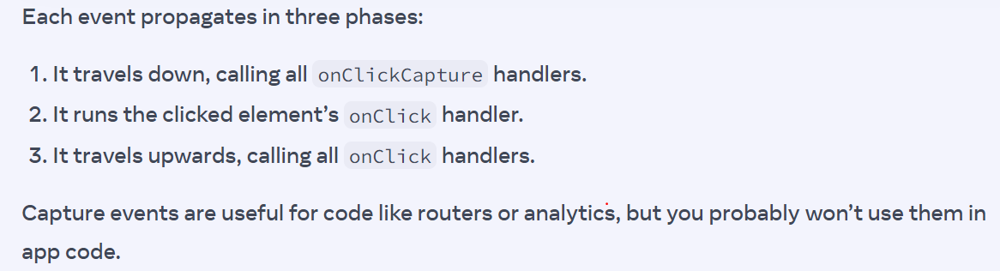

# Error vs Exception

An **error** is when something wrong or invalid happens in the code. It can cause a memory error, it is something that should never happen and can't be treated.

Whereas an exception throws something when certain conditions are met in the code. It may not correspond to a real error.

**In Javascript**, Errors and Exceptions are syntactically synonymous in JavaScript. The language only implements the Error keyword (through window.Error). You may define custom errors, using the Error.constructor, which takes name and message as parameters.

### Convention

By convention, there is a difference between Error and Exception. An Error indicates a clear violation. A TypeError or ReferenceError means you are not following the language specs.

An Exception is thrown when you access an XMLHttpRequest response before it is complete. Error is a "you broke the law" shout and Exception is an "Almost there!" pad on the shoulder.

# Stale Closure

A closure resembles more a **snapshot 📸 of the scope's data** when the function is created.

This means that there's a risk of accessing **outdated data** given the right circumstances.

# Event Propagation

Event will fire at the lowest place then start travel to higher place (parent element) to stop you can use **e.stopPropagation()**

if you want to still notice about event u can use eventName**Capture** to capture it

# No such thing as NESTED OBJECT

They're all object seperately pointing at each other

            let obj1 = {
            title: 'Blue Nana',
            city: 'Hamburg',
            image: 'https://i.imgur.com/Sd1AgUOm.jpg',
            };

            let obj2 = {
            name: 'Niki de Saint Phalle',
            artwork: obj1
            };

            let obj3 = {
            name: 'Copycat',
            artwork: obj1
            };

# Pitfall

Unfortunately, **slice** and **splice** are named similarly but are very different:

- slice lets you copy an array or a part of it.
- splice mutates the array (to insert or delete items).

In React, you will be using slice (no p!) a lot more often because you don’t want to mutate objects or arrays in state. Updating Objects explains what mutation is and why it’s not recommended for state.
