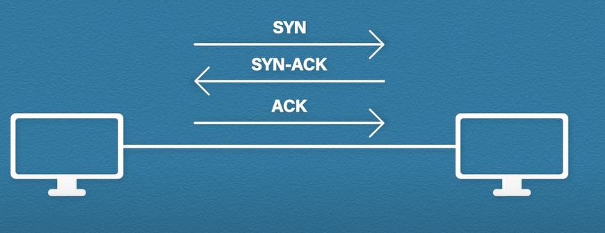
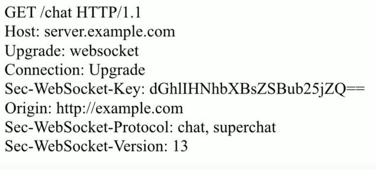
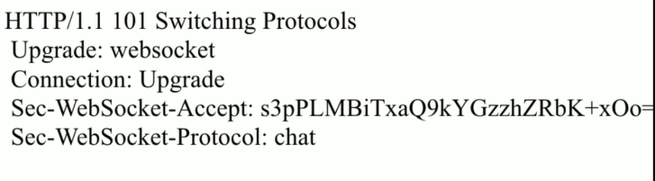
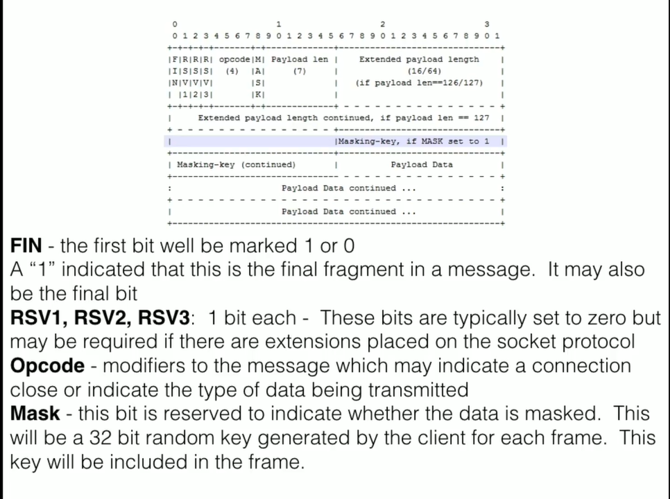
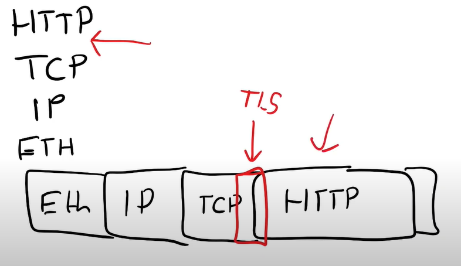

# Short & Long Polling

Short: Send after some small amount of time (ex: 1000ms)

Long: Send then hold for amount of time then response, after receive data, immidietly send another request, else not.

# Socket

After connection established, a socket pipe is created - full duplex persistent

### PingPong

Both try to ping after interval, close if not receive

# Offline messaging

local save last ID -> request to server from that ID + 1 then update to local DB

authen with Socket establish

set cookie with origin socket so it comes along with cookie to authen

# Internet connection

A connection between 2 point - Full Duplex: Data flow back and fort

1 internet connection requires 2 socket

Ex: Youtube socket & client socket

# TCP vs UDP

Transport Layer

## TCP - Transmission control protocol

Connection oriented protocol

Use:

- Ack
- Sequencing
- Checksum

To ensure data won't be missing

## UDP - User Datagram Protocol

Live/real-time

- voice call
- streaming

Has lighter header -> Faster/Low latency

Also has checksum

Connectionless oriented protocol - Fire and forget

### Socket

a socket has 2 part : IP address and Port number

Ex: 127.0.0.1:3000

> 80 is a standard port number

When client make request, they get an asigned port number -> **Ephermeral Port**

## WebHooks vs WebSockets vs HTTP Streaming

### WebHooks

Trigger the server to send events to **pre-defined client endpoints**

#### WebHooks Pitfalls

- Failures: Ensure delivery through retries
- Firewalls: Apps running behind firewalls can send, but receiving can be tricky
- Noise: Many event in a short time can be noisy

### Websockets

3 ways handshake that tell server that client want to use the websocket api, server response with an upgrade. After that is **bidirectional**

Full-duplex communication channels over a **single** TPC connection

WebSocket is a **protocol** based on **TCP Protocol** and breaks data down into **frames**, which are further **broken down into binary bits**. Each bit has significance in the protocol

#### Pros

- low latency
- Reduced overhead of http requests

#### Cons

- Client response for connections
- Scalability problem

#### Client Request Header

#### Server response Header

#### Socket Bits Break down

Each fragments will have an encode key 32bit
-> Avoid poisoning the cache : Make multiple false request, ...

##### TODO: Study this

### Htttp Streaming

Server can send back multiple response after 1 client request

**One way communication over HTTP**

- Server set header to Chunked

#### Pros

- Stream over simple http
- Native browser support

#### Cons

- Bidirectional communication challenge
- Buffering issues

# SSL vs TLS

Authenticate Server & Client and Encrypt data

## SSL - Secure Socket Layer

Server will send a small SSL Cert - cert that used to identify trust end point

## TLS - Transport Layer Security - Latest one

