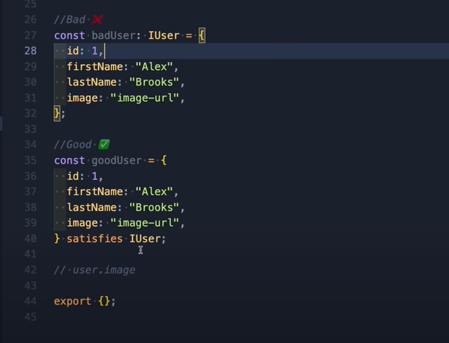

# any vs unknown

When using any, we can not get access to the property of the object.

For example:

    interface IUser {
        name : string
    }
    function getUser() {
        const user = fetchUser(); //this fetch would return a Promise<any>
    }
    
Or we can go like 

    function getUser() {
        const user : IUser = fetchUser();
    }
This will works just fine if we have only the `IUser` interface. What if 
    
    interface IAdminUser extends IUser {
        token : string
    }

How do we tell if user is an admin or normal user if we using `IUser`
So instead, we can try to use `unknown` type and check whether the given data is an admin or normal user

    function isAdmin(user: unknown) : object is IAdminUser {
        //return if given user is an admin
    }
    function getUser() {
        const user : unknown = fetchUser();
        if (isAdmin(user)) {
            //here we would have access to IAdminUser property
        }
    }

With this approach, we would have access to the property of interface during compile time and it would be better for another dev to understand the code

# is 

Use to define whether some `type` is the given `type`.

    object is Admin

# satisfies keyword in TS >= 4.9

# declare enum

remember to put in the declaration for each enum 

# Utility Types

- `Partials<Interface>`: Makes every thing in interface have ? (which means could be `undefined`)
- `Omit<Interface, "property">`: Remove that property out of **Interface**
- `Exclude<Interface, "union-type">`: Remove a union type from interface (use this for union type and omit for object exclude property)